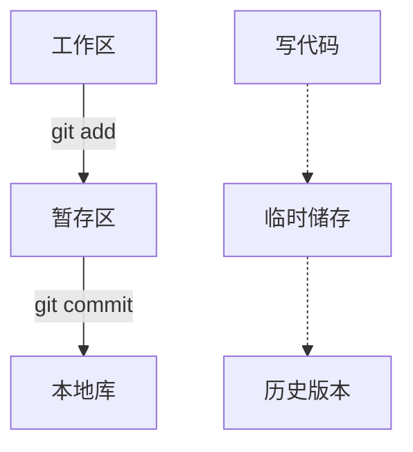

# test1
This is an attempt
---
title: "MyFirstBlog"
date: 2021-01-13T00:32:28+08:00
draft: false

---

# Git的使用

## Git结构



## Git代码托管中心

1. github
2. gitee

## Git协作方式

- 团队内部协作

  ```mermaid
  graph TD
  A[创建者的本地库]-->|1.pull|B(github/gitee中的远程库)
  A-->|2.push|B
  B-->|1.clone|C[成员的本地库]
  C-.->|2.push|B
  ```

- 团队外部贡献

  ```mermaid
  graph LR
  A[创建者的远程库]-->|1.fork|B[团队外部的远程库]
  B-.->|4.pull request -> 审核 -> merge|A
  B-->|2.clone|C[本地库]
  C-.->|3.push|B
  ```

## Git本地库操作

### 本地库初始化

- 命令：git init 

- 注意：.git 目录中的文件不可修改

###  设置签名

- 命令
  - 项目/仓库级别：仅在当前本地仓库有效
    - git config user.name lmx_pro
    - git config user.email lmx@163.com
  - 系统用户级别：当前操作系统用户
    - git config --global user.name lmx_glb
    - git config --global user.email lmx@163.com
  - 级别优先级：项目级别优先于系统级别
    - 如果只有系统级别，则以系统为准
- 作用：区分不同开发人员
  - 注意：这里和远程库的用户无关

### 添加提交、查看状态

1. 状态
   - 命令
     - git status : 查看工作区，缓存区的状态
2. 添加提交
   - 命令
     - git add <file>：将库中文件提交到缓存区
     - git rm --cashed <file> ： 将提交到缓存区的文件撤回
     - git commit -m "在这里输入提交文件的注释" <file> : 将缓存区内容提交到本地库
   - 添加文件修改后的提交
     - git add <file>
     - git restore --staged <file> : 将提交的修改文件撤回
     - git commit -m "commit message" <file>

### 历史版本

1. 查看命令
   - git log
   - git log --pretty=oneline
   - git log --oneline
   - git reflog : 可以查看当前版本到达各个历史版本的距离
2. 回归历史版本
   - git reset --hard <索引值> : 索引值是使用查看命令后显示的哈希值
   - git reset --hard HEAD^^^ : 后退三步
   - git reset --hard HEAD~n : 后退n步

### 比较修改前和修改后的文件

- 命令
  - git diff HEAD : 比较所有修改过的问题
  - git diff <file> 
  - git diff HEAD^ <file> : 从上一个版本的文件进行比较

## Git分支

### 分支概述

1. 分支作用
   - 有利于并行推进多个功能开发，提高开发效率
   - 各个分支在开发过程中，一个分支开发失败不会影响其他分支
2. 分支使用场景
   - 在大型项目开发时，不同的分支有利于不同模块的并行开发

### 分支操作

1. 创建分支
   - git branch [分支名]
2. 查看所有分支
   - git branch -v
3. 切换分支
   - git checkout [分支名]
4. 合并分支
   1. 切换到j将被合并的分支上，如master
      - git checkout [分支名]
   2. 执行merge，分支名为之前修改过的分支
      - git merge [分支名]
   3. 解决冲突
      - 产生原因：不同分支对于同一行进行了不同的修改
      - 解决步骤
        1. 编辑文件，删除特殊符号
        2. 修改文件到满意
        3. git add <file>
        4. git commit -m "commit message" : 不能带文件名

## Github操作

### push操作

1. 在github上创建一个新的仓库，并复制所在链接
2. 在本地给链接起一个别名
   - git remote -v : 查看别名
   - git remote add [别名] [链接]
3. 把本地库push到github上
   - git push [别名] [分支]

### clone操作

1.  git clone [地址]
2.  clone作用
    - 将项目下载到本地
    - 自动初始化（存在.git文件）
    - 存在别名[origin]

### 邀请其他人加入团队


### pull操作

1. 


